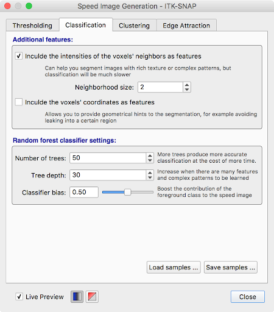
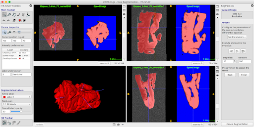

Building a Mold using a 7T MRI scan of the MTL
==============================================

About this Protocol
-------------------
Use this protocol when you have scanned the entire MTL specimen on a 7T MRI scanner. The 7T MRI introduces minimal distortion to the tissue and can be used directly for mold generation. By contrast, the animal 9.4T scaner introduces distortions that have to be corrected by registration to a 7T scan first.

Step 1. Download Input MRI Scan
-------------------------------
Create a new folder for each mold-making project. All files should be saved in this folder. 

The required input to this protocol is a 7T MRI scan of the MTL. It should be converted to the NiFTI file format and saved as :code:`mtl7t.nii.gz`

* When selecting the 7T scan, **do not** use the scan with the :code:`_nd` in its name. Those images are saved without on-the-scanner distortion correction and are not suitable for mold making.

.. _mtl7t-seg:

Step 2. Segment the MTL from the Background in ITK-SNAP
-------------------------------------------------------

1. Load :code:`mtl7t.nii.gz` into ITK-SNAP

2. Enter the automatic (snake) segmentation mode

3. Enter “classification” pre-segmentation mode

4. Label the tissue as “red” label, and background (fomblin) as “green” label

   * If there is some water on top of the sample, label it with another label 

   .. image:: images/snake1.png

5. Under “More…” set the “Neighborhood size” to 2

6. Click “Train Classifier” to isolate foreground from background

7. Repeat this process (adding training samples where the classifier messes up and retraining classifier) until satisfied with the pre-segmentation.

8. Under "More...", save the classifier training samples as :code:`training_samples.nii.gz` 
   
9.  Click “Next” to enter bubble placement mode

10. Move your cursor around the sample and click **Add Bubble at Cursor** to place bubbles. 
    
11. Click **Next** again and run contour (snake) evolution by clicking the play button. Verify that the segmentation is good. **Do not** press *Finish* yet.

12.  Before clicking **Finish**, open the layer inspector window (`Tools -> Layer Inspector…`) and save the **evolving contour** layer as :code:`contour_image.nii.gz`.
    
13. Exit the segmentation mode. You do not need to save the actual segmentation

.. _mtl7t-mold:

Step 3. Create a Reference Mold
-------------------------------

1. Open a terminal window. Make sure that the directory containing :code:`mold_helper.sh` is in your PATH. You can do this by typing:

   .. code:: bash

      PATH=/home/user/.../path/to/mold_helper:$PATH
      export PATH

2. Change directory to the folder containing your files:

   .. code:: bash

      cd /home/user/.../workdir

3. Create a reference mold by typing this command. The value `0.4` is the spacing between cutting slits in mm. It may be adjusted if the slits are too narrow.

   .. code:: bash

      mold_helper.sh make_reference_mold 0.4

4. Running this command will generate an image :code:`reference_mold.nii.gz` in your working folder. Open this image in ITK-SNAP.

Step 4. Position the Specimen in the Mold
-----------------------------------------
In this step, we align the sample in the mold optimally. Optimal alignment takes into account several factors:

* The specimen should lie inside the reference mold, with no portion below the "solid" bottom of the mold, and as little as possible protruding
* The part of the specimen coming into contact with the 3D print should be least valuable - i.e., sides of the specimen where it was cut, as opposed to pial surface.
* The specimen should be approximately aligned with the AC/PC axis when sectioned - this means the hippocampus is at about 20 degree angle to the longitudinal axis of the mold
* The cross-section of the specimen along the cutting direction should fit onto 75x50mm slides. Satidfying this condition may require you to override with the ACPC rule above.

1. Load :code:`reference_mold.nii.gz` as the main image in ITK-SNAP

2. Load :code:`mtl7t.nii.gz`` as the overlay image using `File->Add Another Image`. When prompted, select "As a semi-transparent overlay" option.

3. Enter registration mode (`Tools->Registration`) and go to the "Manual" tab

4. Display the MRI scan as a semi-opaque overlay (if not already displayed this way):

   * `Tools->Layer Inspector`
   * Select the MRI layer
   * Go to the `General` tab
   * Click `Display as semi-transparent overlay` and set opacity to 85%

   .. image:: images/overlay1.png

5. You can play with the color map (`Tools->Layer Inspector`, "Color Map" tab) to get a better transparency display, allowing you to see both the mold and the tissue well. Here we used the `Black to Green` color map and played with the control points to get a nice overlay visualization. 

   .. image:: images/colormap1.png

6. Initially align the MRI to the mold by selecting `Match By...->Image Centers` on the ITK-SNAP registration panel. Then use the wheel to rotate the specimen, and drag away from the wheel to move the sample. 

7. Rotate and move the MRI so that the sample is in approximate AC/PC alignment.  

   * The tissue should be inside the “slitted” region of the reference mold. In other words, the bottom of the tissue should be above the line where the slits begin.
  
   * The tissue should be approximately centered in the mold on the L-R axis and A-P axis. 
  
   * Orient the tissue as in an in vivo MRI scan, bottom of the brain to the bottom of the screen, as shown below. Focus on rotating the sample in the top right window so that the hippocammpus is curving up at about 20 degree angle, and so that the posterior edge of the specimen is approximately parallel to the slits. This assumes that the posterior edge was cut approximately perpendicular to the AC/PC line.

      .. image:: images/rotate1.png

8. Rotate and move the MRI so that the valuable tissue does not get scratched when placing the sample in the mold.  At this point, you should be rotating only in the bottom right window. This keeps the AC/PC alignment even as you rotate the sample.

   * As before, the tissue should be inside the “slitted” region of the reference mold. In other words, the bottom of the tissue should be above the line where the slits begin.
  
   * Medial temporal lobe should be facing up or in such a way that when the sample is lowered into the mold, the MTL and as much of the rest of the temporal lobe cortex does not touch the sides or bottom of the mold.

      .. image:: images/rotate2.png

9. Carefully scan through the length of the mold in the coronal (bottom right) view and check the following:

   * Find a slice in the MRI where the tissue looks to be the largest, and measure the tissue to ensure that the largest portions of the tissue would fit on a 75mm x 50mm glass slide (2”x3” slide). If not, try rotating the sample slightly in the sagittal (top right) view

      .. image:: images/rotate3.png

   * Make sure the sample is inside of the slitted region.

10. When satisfied, use the small floppy disk icon in the bottom right of the registration panel above close to save your registration as `holderrotation.mat`

   .. image:: images/savemat.png

11. Save your workspace (`Workspace->Save Workspace`) as :code:`INDD123456_mold7t.itksnap`

Step 5. Carve the tissue segmentation out of the mold
-----------------------------------------------------

1. This command carves out the tissue segmentation out of the mold. It generates an image that is positive inside the plastic mold and negative in the air.

   .. code:: bash

      mold_helper.sh make_reference_mold 0.4

Step 6. Trim the mold to reduce plastic use
-------------------------------------------

1. Open :code:`slitmold.nii.gz` in a new ITK-SNAP window
2. Load :code:`mtl7t.nii.gz` as an additional image
3. Enter registration mode and use the open icon to load :code:`holderrotation.mat`
4. Draw the trimming polygon at the top of the sample:
   * Use the Crosshairs tool to position the cursor slightly superior to the top of the sample
   * Use the Polygon tool and draw around the tissue but leaving out excess plastic, like shown below. Try to not leave any very thin slivers of plastic as you do this - position the vertices of the polygon inside of the slits. 
   * Once polygon is drawn (you can edit the individual vertices), click `accept`
  
      .. image:: images/trimpoly.png

5. Draw the trimming polygon at the bottom of the sample:
   * Use Crosshairs tool again to position the cursor (same horizontal blue line) about 5mm below the bottom of the slits. This will result in less plastic at the bottom of the mold.  
  
      .. image:: images/trimpoly2.png

   * Click the Polygon tool again, then click `paste last polygon` to draw the identical polygon in that slice. 
   * Click `accept` again 

6. Interpolate between these polygons using `Tools->Interpolate` Labels
  
      .. image:: images/trimpoly3.png

7. Save the segmentation as :code:`cropmask.nii.gz`

8. Run the following command to crop the block:

   .. code:: bash

      mold_helper.sh finish_mold

   * This should generate files :code:`slitmold.stl` and :code:`sample_inplace_mesh.stl`. These files are huge and need to be simplified before 3D printing.

Step 7. Process meshes in MeshLab
---------------------------------

1. You need to download MeshLab for this step. 
2. Run Meshlab and load :code:`slitmold.stl` using `File->Import Mesh`
3. Go to `Filters->Remeshing->Quadric Edge Collapse Decimation` and set options as recommended below:
   *  Percentage reduction: 0.1
   *  Preserve boundary: checked
   *  Preserve normal: checked
   *  Preserve topology: checked   
   *  Optimal position: checked
   *  Planar simplification: checked
   *  Post-simplification: checked
   *  Hit `Apply`. It may take a few minutes.
  
      .. image:: images/meshlab1.png

4. The simplified mesh should be visually similar to the input mesh, but will have 90% fewer faces. 
5. Save mesh (using `File->Export Mesh...`), overriding the existing very large mesh.
  
      .. image:: images/meshlab2.png

6. Repeat the same process for :code:`sample_inplace_mesh.stl`, however:
   * After loading the mesh, the shading will be wrong. Select `Filters->Normals, Curvatures and Orientation->Invert Faces Orientation` and run that filter after loading the mesh.

Step 8. Visualize sample placement in mold
------------------------------------------
1. Open the meshes :code:`slitmold.stl` and :code:`sample_inplace_mesh.stl` in ParaView.
2. Adjust the color and transparency of the meshes for good visualization
3. Take screenshots from a few angles
  
      .. image:: images/paraview1.png
  
      .. image:: images/paraview2.png

